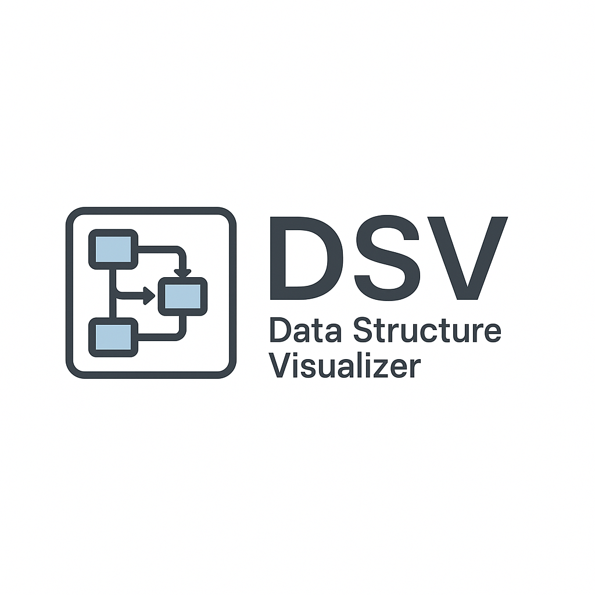

<div align="center">
  
  
  # 🎯 Data Structures Visualizer (DSV)
  
  **Interactive Web-Based Learning Tool for Data Structures & Algorithms** 📚✨
  
  [](https://python.org)
  [](https://flask.palletsprojects.com)
  [](LICENSE)
  
</div>

---

## 🚀 Overview

DSV is a powerful, interactive web application that brings data structures and sorting algorithms to life! Perfect for students, educators, and developers who want to visualize and understand how fundamental computer science concepts work under the hood.

## ✨ Features

### 🔄 Sorting Algorithms
Visualize step-by-step sorting with beautiful animations:
- 🫧 **Bubble Sort** - Watch elements bubble to their correct positions
- 🎯 **Selection Sort** - See the selection of minimum elements
- 📝 **Insertion Sort** - Observe elements being inserted in order  
- 🔀 **Merge Sort** - Experience the divide-and-conquer approach

### 🏗️ Data Structures
Interactive manipulation of core data structures:
- 🔗 **Linked Lists** - Insert/delete from beginning or end with visual connections
- 📚 **Stacks** - Push/pop operations with LIFO visualization
- 🚶‍♂️ **Queues** - Enqueue/dequeue with FIFO demonstration

### 🎮 Interactive Controls
- 🎲 **Custom Array Generation** - Set size, min/max values
- ⚡ **Speed Control** - Adjust animation speed to your preference
- 👆 **Step-by-Step Mode** - Manual control over each operation
- 🤖 **Auto Mode** - Sit back and watch the magic happen

## 🛠️ Installation & Setup

### Prerequisites
Make sure you have Python 3.7+ installed on your system.

### Quick Start
```bash
# 📥 Clone the repository
git clone https://github.com/jishanahmed-shaikh/Algorithm-Visualizer.git
cd Algorithm-Visualizer

# 📦 Install dependencies
pip install flask numpy

# 🚀 Run the application
python app.py

# 🌐 Open your browser and navigate to:
# http://127.0.0.1:5000
```

## 🎯 How to Use

1. **🎲 Generate Data**: Create custom arrays or use random generation
2. **🔧 Choose Algorithm**: Select from bubble, selection, insertion, or merge sort
3. **⚡ Set Speed**: Adjust animation speed using the slider
4. **▶️ Visualize**: Watch your data come to life with smooth animations
5. **🏗️ Explore Structures**: Switch to stacks, queues, or linked lists for hands-on learning

## 🔌 API Endpoints

### Sorting Operations
- `POST /generateDS` 🎲 - Generate random array
- `POST /sort` 🔄 - Execute sorting algorithm

### Linked List Operations  
- `POST /linkedlist/insert_beginning` ➕ - Insert at head
- `POST /linkedlist/insert_end` ➕ - Insert at tail
- `POST /linkedlist/delete_beginning` ➖ - Delete from head
- `POST /linkedlist/delete_end` ➖ - Delete from tail

### Stack Operations
- `POST /stack/push` ⬆️ - Push element
- `POST /stack/pop` ⬇️ - Pop element

### Queue Operations
- `POST /queue/enqueue` ➡️ - Add to queue
- `POST /queue/dequeue` ⬅️ - Remove from queue

## 🛠️ Tech Stack

- **🐍 Backend**: Python + Flask
- **🧮 Data Processing**: NumPy
- **🎨 Frontend**: HTML5, CSS3, Vanilla JavaScript
- **📱 Responsive Design**: Mobile-friendly interface
- **🎭 Animations**: CSS transitions + JavaScript

## 🎯 Educational Benefits

- **👁️ Visual Learning**: See algorithms in action
- **🧠 Concept Reinforcement**: Interactive manipulation builds understanding
- **⏱️ Complexity Analysis**: Observe time complexity differences
- **🎓 Perfect for**: Computer Science students, coding bootcamps, self-learners

## 🚀 Future Enhancements

- 🌳 **Tree Structures**: Binary trees, AVL trees, heaps
- 📊 **Graph Algorithms**: BFS, DFS, shortest path
- 🔍 **Search Algorithms**: Binary search, linear search
- 🎨 **Enhanced UI**: Dark mode, themes, better animations
- 📱 **Mobile App**: Native iOS/Android versions
- 🔊 **Audio Feedback**: Sound effects for operations

## 🤝 Contributing

We love contributions! Here's how you can help:

1. 🍴 Fork the repository
2. 🌿 Create a feature branch (`git checkout -b feature/amazing-feature`)
3. 💾 Commit your changes (`git commit -m 'Add amazing feature'`)
4. 📤 Push to the branch (`git push origin feature/amazing-feature`)
5. 🔄 Open a Pull Request

## 📄 License

This project is licensed under the MIT License - see the [LICENSE](LICENSE) file for details.

<div align="center">
  
  **🎓 Start your data structures journey today!** 
  
  Made with ❤️ for the learning community
  
  ⭐ **Star this repo if it helped you learn!** ⭐
  
</div>